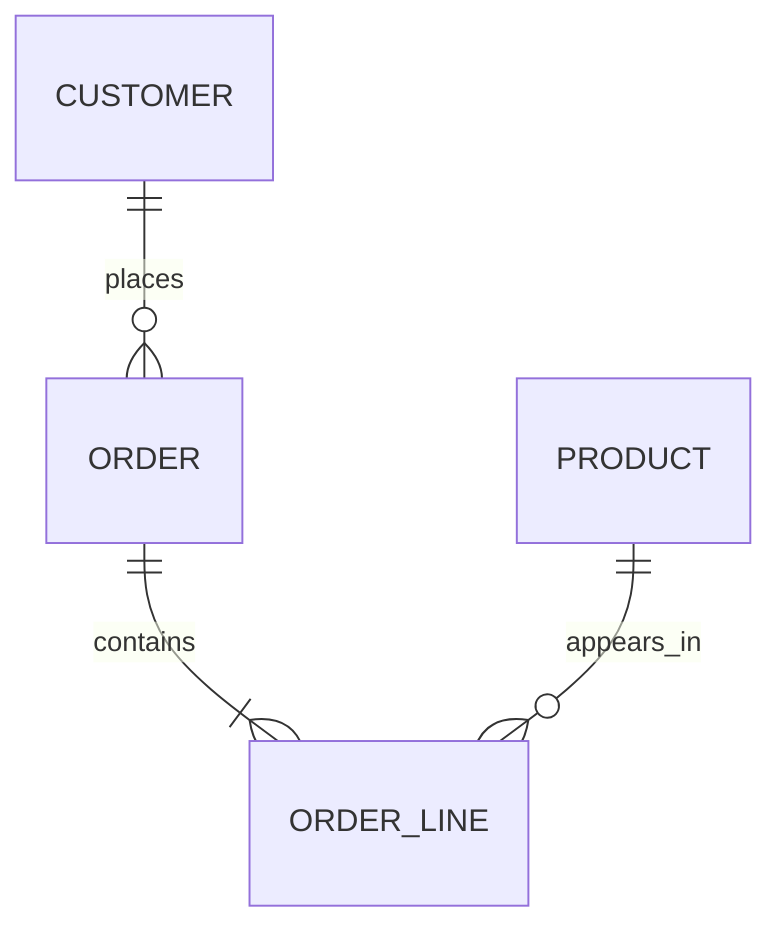

# Domain entities

## Entity

| Entity | Thuộc tính chính | Ràng buộc |
|---|---|---|
| Product | id, name, category, unitPrice | id duy nhất; giá >= 0 |
| Customer | id, region, segment | id duy nhất |
| Order | id, orderDate, customerId, channel, status | id duy nhất; chỉ đơn `completed` tạo doanh thu |
| OrderLine | orderId, productId, quantity, unitPrice, discount | quantity nguyên dương; discount từ 0 đến 1 |
| AnalyticsPeriod | start, end | start <= end; dùng khoảng đóng ở cả hai đầu |
| KpiSummary | revenue, orders, aov, customers, comparison | giá trị tiền >= 0; `aov = revenue / orders` hoặc 0 |
| Evidence | metric, value, period, dimension?, explanation | luôn có metric, value, period |
| InsightResponse | answer, evidence, actions, source, limitations? | phải có ít nhất một evidence nếu là câu trả lời có kết luận |

## Quan hệ

## Các khái niệm nghiệp vụ

- **Doanh thu**: tổng `quantity * unitPrice * (1 - discount)` của order line thuộc đơn hoàn tất trong kỳ.
- **Số đơn hàng**: số order hoàn tất phân biệt theo id trong kỳ.
- **AOV**: doanh thu / số đơn; 0 khi không có đơn.
- **Khách hàng**: số customerId phân biệt có đơn hoàn tất trong kỳ.
- **Kỳ trước**: khoảng thời gian có cùng độ dài ngay trước kỳ hiện tại.
