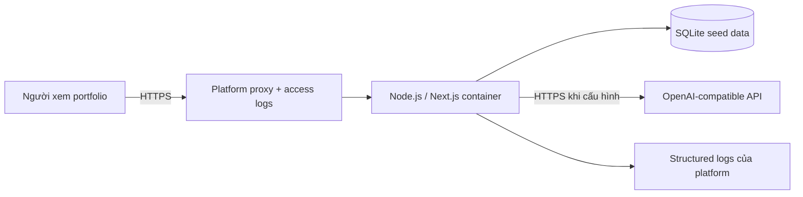

# Kiến trúc triển khai

CI cài dependency theo lockfile, lint, test, audit và tạo SBOM; sau đó build image Node LTS đã pin version. Platform deploy image cùng secrets, chạy migration/seed an toàn và health check. Seed data có thể tái tạo; AI provider lỗi không làm dashboard unavailable vì fallback.
