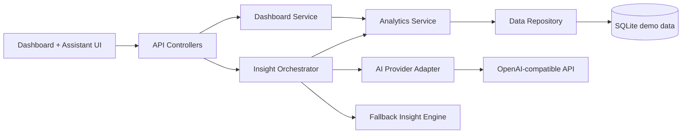

# Phụ thuộc thành phần và luồng dữ liệu

## Luồng chính

## Ma trận phụ thuộc

| Thành phần | Phụ thuộc trực tiếp | Kiểu giao tiếp |
|---|---|---|
| Dashboard UI | API Controllers | HTTPS/JSON |
| Assistant UI | API Controllers | HTTPS/JSON |
| API Controllers | Dashboard Service, Insight Orchestrator, Validation | Lời gọi nội bộ |
| Dashboard Service | Analytics Service | Lời gọi nội bộ |
| Insight Orchestrator | Analytics Service, AI Adapter, Fallback Engine | Lời gọi nội bộ |
| Analytics Service | Data Repository | Interface nội bộ |
| Data Repository | SQLite | Truy vấn tham số hóa |
| AI Provider Adapter | OpenAI-compatible API | HTTPS/TLS |

## Nguyên tắc coupling

- UI không biết chi tiết database, analytics hay API key.
- AI Provider có thể thay thế vì được bọc trong adapter.
- Fallback dùng chung evidence/analytics với luồng LLM để giữ tính đúng đắn.
- Tất cả truy cập dữ liệu đi qua repository và không có raw SQL ghép chuỗi từ input người dùng.
