# Kế hoạch thực hiện - AI Business Intelligence Assistant

## Phân tích chi tiết

### Phạm vi và tác động

- **Thay đổi hướng người dùng**: Có. Đây là ứng dụng web mới với dashboard và hội thoại AI.
- **Thay đổi cấu trúc**: Có. Cần các lớp giao diện, API, dữ liệu/analytics, AI orchestration và kiểm thử.
- **Thay đổi mô hình dữ liệu**: Có. Dữ liệu demo phải mô tả đơn hàng, sản phẩm, khách hàng, kênh và thời gian.
- **Thay đổi API**: Có. Cần API phục vụ dashboard và hỏi đáp AI.
- **Tác động phi chức năng**: Cao. Bảo mật và property-based testing đã được bật đầy đủ.

### Rủi ro

- **Mức rủi ro**: Trung bình.
- **Lý do**: Rủi ro chính nằm ở câu trả lời AI không có căn cứ, lộ khóa API, và độ tin cậy của chế độ demo.
- **Giảm thiểu**: Ràng buộc AI với dữ liệu/metrics có cấu trúc, chế độ fallback xác định, kiểm tra input, rate limiting, không gửi bí mật xuống client, kiểm thử theo kịch bản và property-based testing.
- **Độ phức tạp kiểm thử**: Cao vừa phải, do gồm UI, API, tính đúng của tính toán KPI và các tình huống lỗi.

## Quy trình thực hiện

```mermaid
flowchart TD
    Start(["Yêu cầu đã duyệt"]) --> WD["Khảo sát workspace<br/>HOÀN TẤT"]
    WD --> RA["Phân tích yêu cầu<br/>HOÀN TẤT"]
    RA --> WP["Lập kế hoạch quy trình<br/>HOÀN TẤT"]
    WP --> US["User stories<br/>THỰC HIỆN"]
    US --> AD["Thiết kế ứng dụng<br/>THỰC HIỆN"]
    AD --> UG["Tạo đơn vị công việc<br/>THỰC HIỆN"]
    UG --> FD["Thiết kế chức năng<br/>THỰC HIỆN"]
    FD --> NR["Yêu cầu & thiết kế NFR<br/>THỰC HIỆN"]
    NR --> ID["Thiết kế hạ tầng<br/>THỰC HIỆN"]
    ID --> CG["Sinh mã nguồn<br/>THỰC HIỆN"]
    CG --> BT["Build & kiểm thử<br/>THỰC HIỆN"]
    BT --> End(["Hoàn thành"])

    style WD fill:#4CAF50,stroke:#1B5E20,stroke-width:3px,color:#fff
    style RA fill:#4CAF50,stroke:#1B5E20,stroke-width:3px,color:#fff
    style WP fill:#4CAF50,stroke:#1B5E20,stroke-width:3px,color:#fff
    style US fill:#FFA726,stroke:#E65100,stroke-width:3px,stroke-dasharray: 5 5,color:#000
    style AD fill:#FFA726,stroke:#E65100,stroke-width:3px,stroke-dasharray: 5 5,color:#000
    style UG fill:#FFA726,stroke:#E65100,stroke-width:3px,stroke-dasharray: 5 5,color:#000
    style FD fill:#FFA726,stroke:#E65100,stroke-width:3px,stroke-dasharray: 5 5,color:#000
    style NR fill:#FFA726,stroke:#E65100,stroke-width:3px,stroke-dasharray: 5 5,color:#000
    style ID fill:#FFA726,stroke:#E65100,stroke-width:3px,stroke-dasharray: 5 5,color:#000
    style CG fill:#4CAF50,stroke:#1B5E20,stroke-width:3px,color:#fff
    style BT fill:#4CAF50,stroke:#1B5E20,stroke-width:3px,color:#fff
    style Start fill:#CE93D8,stroke:#6A1B9A,stroke-width:3px,color:#000
    style End fill:#CE93D8,stroke:#6A1B9A,stroke-width:3px,color:#000
```

## Các giai đoạn sẽ thực hiện

### KHỞI TẠO

1. **User Stories**: Cần thiết vì sản phẩm có giao diện người dùng, hành trình khám phá dữ liệu và tiêu chí nghiệm thu rõ ràng.
2. **Thiết kế ứng dụng**: Cần thiết để xác định ranh giới UI, analytics, AI, API và dữ liệu.
3. **Tạo đơn vị công việc**: Cần thiết vì dự án có nhiều thành phần, API và logic nghiệp vụ.

### XÂY DỰNG

4. **Thiết kế chức năng**: Cần thiết để xác định cách tính KPI, truy vấn insight, fallback và các tính chất cần kiểm thử.
5. **Yêu cầu & thiết kế NFR**: Cần thiết để chọn stack, áp dụng Security Baseline và Property-Based Testing.
6. **Thiết kế hạ tầng**: Cần thiết để mô tả triển khai demo, biến môi trường, logging, secrets và security headers.
7. **Sinh mã nguồn**: Bắt buộc; xây dựng ứng dụng và các bài kiểm thử.
8. **Build & kiểm thử**: Bắt buộc; xác nhận build, kiểm thử unit/integration/PBT và kiểm tra bảo mật cơ bản.

## Các giai đoạn bỏ qua

- **Phân tích ngược**: Bỏ qua vì đây là dự án mới, không có mã nguồn sẵn có.
- **Operations**: Chưa có trong AI-DLC; tài liệu triển khai demo sẽ được tạo trong giai đoạn xây dựng.

## Sản phẩm bàn giao

- Ứng dụng web AI BI Assistant chạy được.
- Dữ liệu demo và tài liệu mô hình dữ liệu.
- Dashboard, biểu đồ, trợ lý hỏi đáp AI có căn cứ, câu hỏi gợi ý và fallback demo.
- Kiểm thử ví dụ và property-based testing.
- Tài liệu chạy, kiểm thử và triển khai portfolio.

## Ước lượng

- **Số giai đoạn còn lại**: 8 giai đoạn AI-DLC, chưa tính các vòng duyệt tài liệu.
- **Cách triển khai**: Làm tuần tự theo các cổng duyệt để bảo đảm tài liệu, thiết kế và mã nguồn nhất quán.
